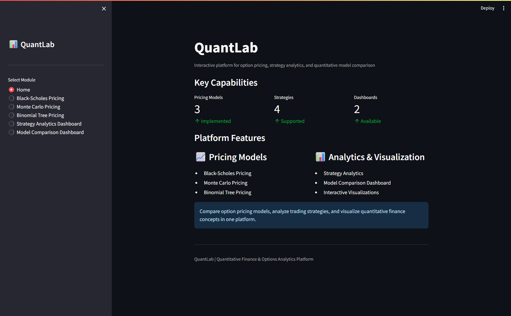
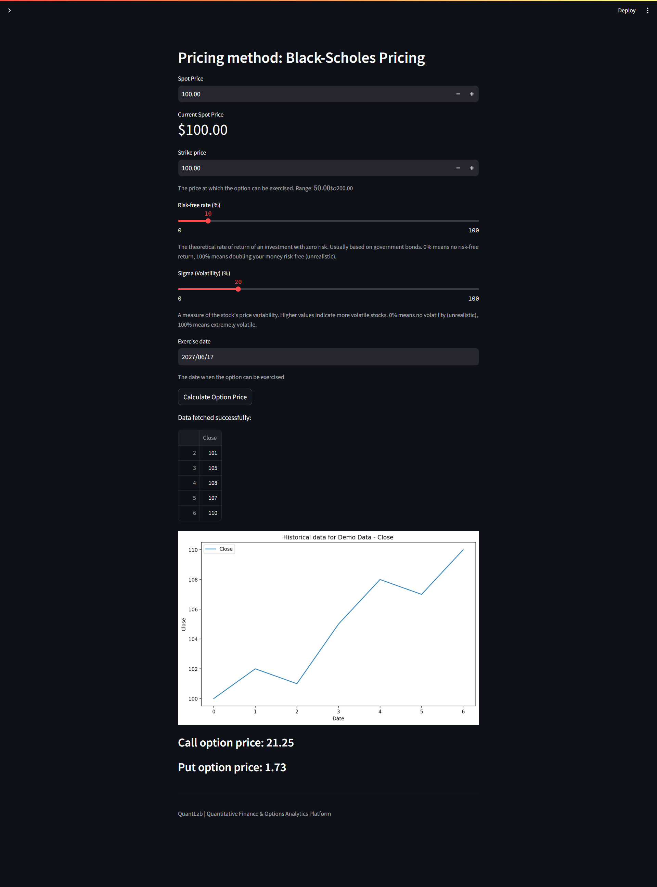
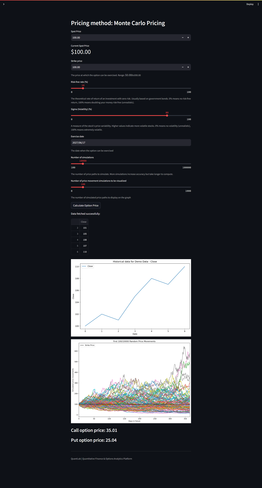
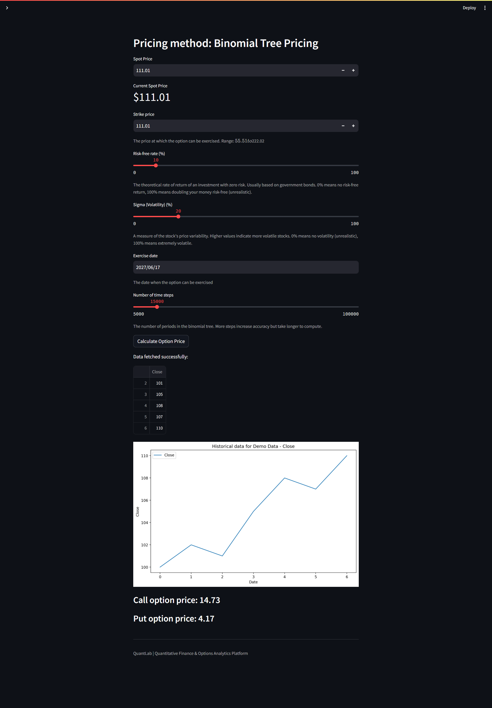
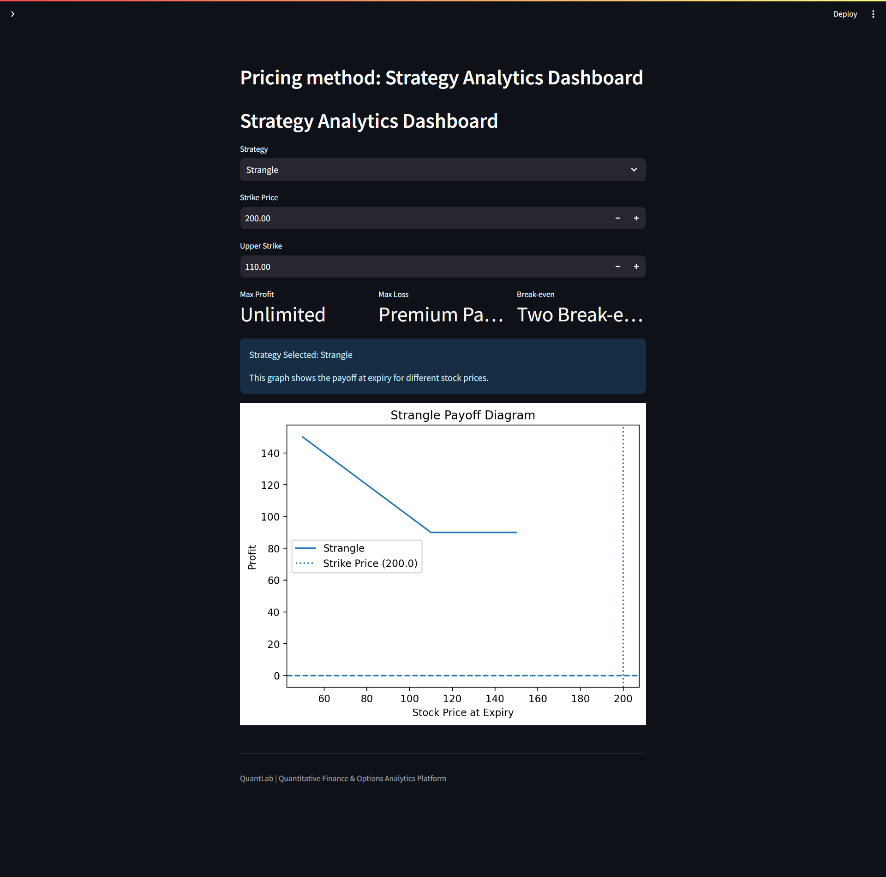
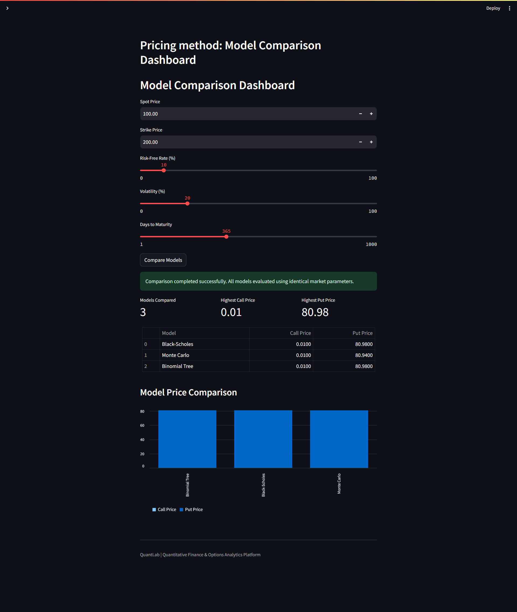

# QuantLab

## Quantitative Finance Analytics Platform

QuantLab is an interactive quantitative finance analytics platform built using Python and Streamlit.

The platform enables users to price financial derivatives using multiple quantitative models, analyze option trading strategies, and compare model outputs through interactive dashboards and visualizations.

---
## Live Demo

🚀 Live Application: https://pratyush345-quantlab-streamlit-app-ounm31.streamlit.app/

---


## Features

### Option Pricing Models

- Black-Scholes Pricing
- Monte Carlo Pricing
- Binomial Tree Pricing

### Strategy Analytics Dashboard

Supports:

- Long Call
- Long Put
- Straddle
- Strangle

Includes:
- Payoff diagrams
- Risk metrics
- Interactive visualizations

### Model Comparison Dashboard

Compare option prices generated using:

- Black-Scholes Model
- Monte Carlo Simulation
- Binomial Tree Model

Features:
- Comparison table
- Comparison chart
- Performance metrics

---

## Technology Stack

- Python
- Streamlit
- NumPy
- Pandas
- Matplotlib

---

## Screenshots

### Home Dashboard



---

### Black-Scholes Pricing Engine



Features:
- Option pricing using the Black-Scholes model
- Adjustable market parameters
- Call and put option valuation
- Historical price visualization

---

### Monte Carlo Pricing Engine



Features:
- Simulation-based option pricing
- Random path generation
- Parameter sensitivity analysis
- Interactive visualizations

---

### Binomial Tree Pricing Engine



Features:
- Discrete-time option pricing
- Call and put valuation
- Adjustable tree parameters
- Comparative pricing analysis

---

### Strategy Analytics Dashboard



Supported Strategies:
- Long Call
- Long Put
- Straddle
- Strangle

Includes:
- Payoff diagrams
- Risk metrics
- Interactive strategy analysis

---

### Model Comparison Dashboard



Includes:
- Black-Scholes comparison
- Monte Carlo comparison
- Binomial Tree comparison
- Comparative pricing charts
- Performance metrics

---

## Project Structure

```text
QuantLab
│
├── Home Dashboard
├── Black-Scholes Pricing Engine
├── Monte Carlo Pricing Engine
├── Binomial Tree Pricing Engine
├── Strategy Analytics Dashboard
└── Model Comparison Dashboard
```

---

## Installation

```bash
pip install -r requirements.txt
```

## Run Application

```bash
streamlit run streamlit_app.py
```

---

## Key Highlights

- Interactive quantitative finance platform
- Multiple option pricing methodologies
- Strategy payoff visualization
- Comparative model analysis
- Dashboard-driven user experience
- Real-time parameter sensitivity analysis

---

## Future Enhancements

- Option Greeks Analysis
- Volatility Surface Visualization
- American Option Pricing Models
- Live Market Data Integration
- Portfolio Risk Analytics

---

## Author

**Pratyush Jha**